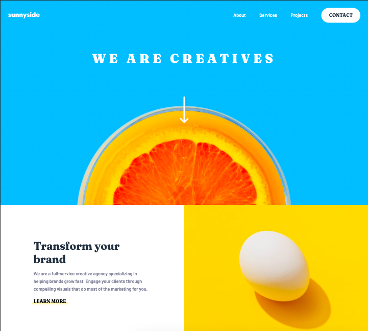
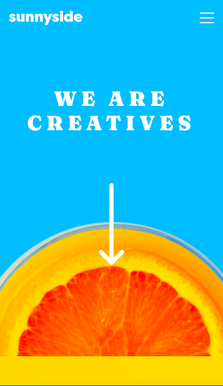

# Frontend Mentor - Sunnyside agency landing page solution

This is a solution to the [Sunnyside agency landing page challenge on Frontend Mentor](https://www.frontendmentor.io/challenges/sunnyside-agency-landing-page-7yVs3B6ef). Frontend Mentor challenges help you improve your coding skills by building realistic projects.

## Table of contents

- [Overview](#overview)
  - [The challenge](#the-challenge)
  - [Screenshot](#screenshot)
  - [Links](#links)
- [My process](#my-process)
  - [Built with](#built-with)
- [Author](#author)

## Overview

### The challenge

Users should be able to:

- View the optimal layout for the site depending on their device's screen size
- See hover states for all interactive elements on the page

### Screenshot

### Links

- Solution URL: https://github.com/shoproizoshlo/sunnyside-agency-landing-page-main
- Live Site URL: https://sue-sunnyside-agency-landing-page.netlify.app/

## My process

### Built with

- Semantic HTML5 markup
- CSS custom properties
- Flexbox
- Bootstrap

## Author

- Website - [Sue Brechko](https://github.com/shoproizoshlo)
- Frontend Mentor - [@shoproizoshlo](https://www.frontendmentor.io/profile/shoproizoshlo)
- Twitter - [@suereact](https://www.twitter.com/suereact)
